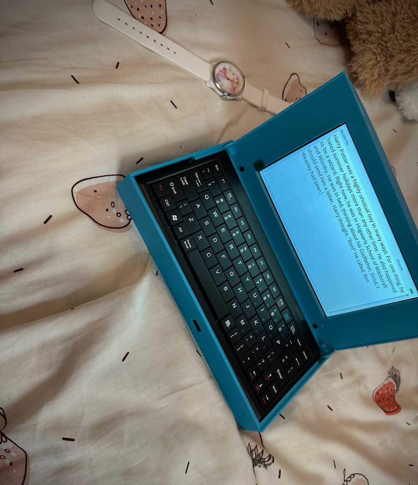
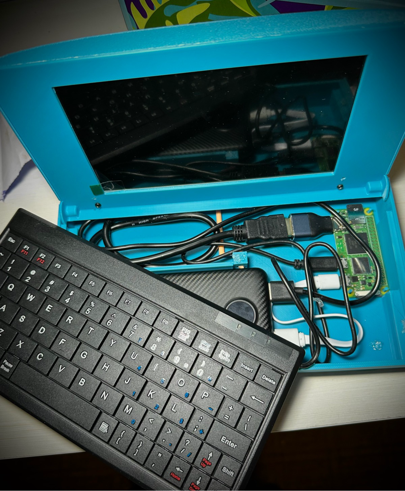
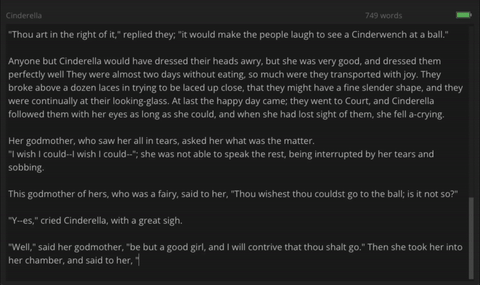
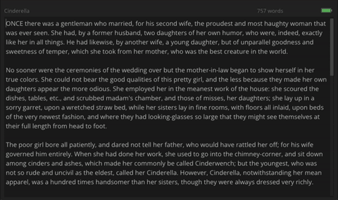

# JustType (Prototype Software)

<table>
  <tr>
    <td valign="top" width="320">
      
    </td>
    <td valign="top">
      <p>I built this as a birthday gift for my daughter.</p>
      <p>She had started writing stories and learning to type, and I wanted to support that without giving her a full laptop full of distractions. Most dedicated writing devices I found were around $500, so I built a simple one myself for about $70 in parts: keyboard, screen, battery, and a single-purpose writing app.</p>
      <p>This repository is the writing software used on the Raspberry Pi prototype.</p>
      <p>If you want the full build story and prototype timeline, start here:<br />
      <a href="https://justtypeleaf.com/journey?entry=home">justtypeleaf.com/journey</a></p>
      <p>If you want the printable prototype case files, start here:<br />
      <a href="https://justtypeleaf.com/prototype-files?entry=home">justtypeleaf.com/prototype-files</a></p>
    </td>
  </tr>
</table>

## Current Prototype Hardware

<table>
  <tr>
    <td valign="top">
      
    </td>
    <td valign="top">
      <ul>
        <li>Raspberry Pi Zero 2W</li>
        <li>7" 1024x600 display (buyDisplay)</li>
        <li>Slim wired keyboard</li>
        <li>10,000mAh power bank</li>
        <li>3D printed enclosure</li>
      </ul>
    </td>
  </tr>
</table>

## What This Software Does

<table>
  <tr>
    <td valign="top">
      
      <br />
      
    </td>
    <td valign="top">
      <ul>
        <li>Launches straight into a writing interface (no desktop workflow)</li>
        <li>Auto-saves edits using a debounce timer: changes are buffered in memory, then flushed to disk after a short idle window to reduce write frequency while keeping data loss risk low</li>
        <li>Stores all files as plain text in the local <code>user_files/</code> folder</li>
        <li>Remembers editor state so the user can pick up where they left off</li>
        <li>Includes a file sidebar, in-editor search, and keyboard-first controls</li>
        <li>Includes built-in keyboard shortcuts focused on writing flow (for example: <code>Ctrl+Up</code> / <code>Ctrl+Down</code> paragraph jump, <code>Shift+Arrow</code> selection, <code>Ctrl+Backspace</code> delete previous word)</li>
        <li>Supports dark/light theme toggle and font size adjustment</li>
      </ul>
    </td>
  </tr>
</table>

The app is intentionally focused and minimal.

## Build

### Dependencies

- CMake (3.16+)
- C++17 compiler
- SDL2 development package

### Build Commands

```bash
cmake -S . -B build
cmake --build build
```

## Run

Run from the `build/` directory so relative paths resolve correctly:

```bash
cd build
./justtype
```

The app expects these paths relative to the executable:

- `../fonts/OpenSans-Regular.ttf`
- `../user_files/`

## Notes on File Transfer

For the Pi prototype, files are currently moved off-device over SSH.  
A QR-based export flow is in progress.

## Project Direction

The Pi prototype validated the core idea: fast access to writing, no distractions.

The current product-design direction moves away from Linux toward an MCU-based stack.

### Hardware

- MCU firmware platform
- Compact 60% keyboard layout
- Folio-style enclosure
- Lid-open wake, lid-close sleep
- USB-C and/or multi-QR transfer
- Target boot/wake under 3 seconds

### Software (LVGL)

- New LVGL-based writing interface
- Folder support for organizing files
- QR export flow for file transfer
- Simple spellcheck for writing assistance

## Why This Exists

This started as a one-off gift, but it exposed a gap: a focused writing device that is actually affordable.

The goal is still simple: open it and write. Follow our journey at 
[justtypeleaf.com/journey](https://justtypeleaf.com/journey?entry=home)
